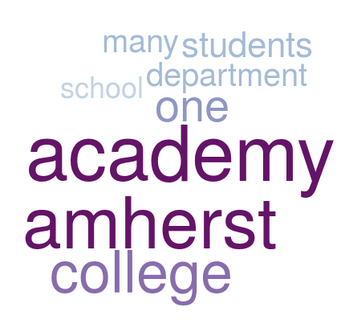
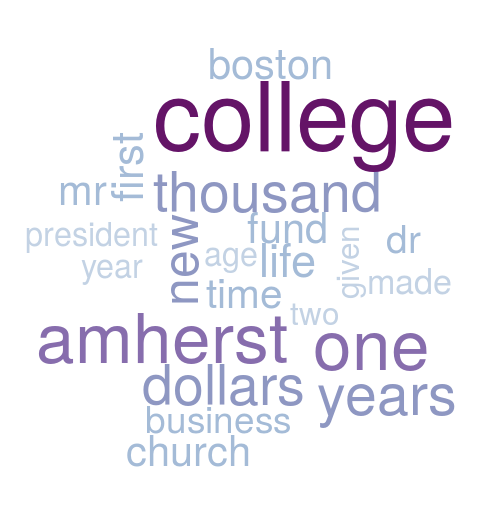
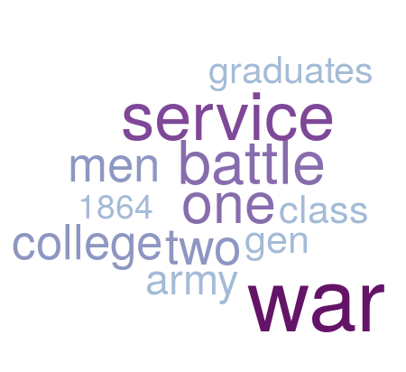

```{r, setup, include=FALSE}
library(mosaic)  
library(tidyverse)
library(mdsr)
library(readtext)
library(tidytext)
library(dplyr)
library(tidyr)
library(gdata)
library(ggplot2)
library(tokenizers)
library(stopwords)
library(kableExtra)
knitr::opts_chunk$set(
  tidy=FALSE,     # display code as typed
  size="small")   # slightly smaller font for code
```

```{r wrap-hook, include=FALSE}
# redefine the output hook function so that you can instruct some chunks to 
# hard-wrap their output lines
# source: https://github.com/yihui/knitr-examples/blob/master/077-wrap-output.Rmd
library(knitr)
hook_output = knit_hooks$get('output')
knit_hooks$set(output = function(x, options) {
  # this hook is used only when the linewidth option is not NULL
  if (!is.null(n <- options$linewidth)) {
    x = knitr:::split_lines(x)
    # any lines wider than n should be wrapped
    if (any(nchar(x) > n)) x = strwrap(x, width = n)
    x = paste(x, collapse = '\n')
  }
  hook_output(x, options)
})
```

\newpage

# Executive Summary (for Biddy)

Facts do not speak for themselves. One could argue that history cannot be purely objective as the past only turn into facts of history by virtue of both significance and subsequent elements of interpretation attached to them by the historians. Neil Munro, a Scottish journalist and literary critic, argues in his essay on "Objectivity in History" that the notion of historical truth is hindered by the inherent subjectivity in the mind of the historian, regardless of their objective methodologies [@munroneilObjectivityHistory]. He comments that a historian who, "gathers the facts from the history is also a human being, who comes with a full complement of background, education, attitudes, opinions, likes and dislikes. Historian will inevitably see the course of history through those particular eyes." 

We analyzed a detailed and thorough documentation called "History of Amherst College during its first half century, 1821-1871" (we will refer to this text as "the History") by William Seymour Tyler [@tylerHistoryAmherstCollege1873]. Tyler graduated as part of the Amherst College Class of 1830, was a Williston Professor of Latin and Greek at Amherst. 

With the bicentennial celebrations of Amherst College, we thought it would be interesting to explore and rediscover the founding fifty years of our college's history through Tyler's historical archive. Additionally, we believed that a text analysis of the History was warranted, given  the limitations of both history and the historian. We hope to gain insight into the College's history, specifically what key events are highlighted, and how did Tyler as the historian interpret and depict the History. 

First, we explored the text to get a sense of the book's content and to quantify what the book is about. We looked at the words that made up the book and determined the word's term frequency ($tf$) and inverse document frequency ($idf$). Unsurprisingly, terms like college, history, academy, work, institution, war, trustees, Amherst, and Williams were some of the most common words in the book (based on the $tf$ statistic that tells us how frequently a word occurs in a given document). In contrast, words like villages (chapter 1), article and convention (both chapter 4), Williamstown (chapter 5), revival (chapter 18), battle and army (both chapter 26), celebration (chapter 27) were some of the most unique and rare words used in the book (based on the $tf-idf$ statistic). The $tf-idf$ statistic was proven useful as a scoring measure used in summarization of the chapters of the History. These keywords belong to specific chapters, making them characteristic terms that represent the chapter of interest and give us a quick taste of the chapter's contents. 

Then, we conducted sentiment analysis, the process of using text analysis and statistics to extract and identify sentiment of words into positive or negative categories. Our analysis conclude that the book had an overall strong positive presence. Notably, we found two chapters to be particularly strong in negative sentiments: Chapter 14 (Period of Reaction and Decline - Resignation of President Humphrey) and Chapter 26 (The War). The historian craft is about telling all the facts, showing all sides to the story - the good, the bad, and the ugly. Still, what is written in this book is relative to the customs, tastes, and opinions of the historian. We appreciated Tyler's faithful attempt at the reconstruction of the College's history. 

Finally, we designed a word cloud Shiny app (https://r.amherst.edu/apps/nhorton/historyG) to get a visual overview of what the book as a whole and also what each individual chapter is about. For example, below is the word cloud for Chapter 26: The War. The Shiny app is a fun, dynamic platform where we can show the keywords of each chapter to any curious reader. 

Through this analysis, we were able to gain insight into the founding fifty years of Amherst College. We were successful in achieving both of our goals: 

1. By generating the word clouds, we were able to extract the topics that were covered in each chapter. These word clouds gave us quick glimpses of the key events in Amherst College's founding fifty years (i.e. the Amherst Academy, the rift with Williams College, resignation of President Humphrey, the war, etc.)

2. The sentiment analysis gave us a sense of how Tyler projected - both intentionally and unintentionally - his biases, interpretations, and opinions on the subject matter. Overall, he spoke highly and positively of the College's history. With that being said, a diverse array of sentiments (fear, joy, disgust, anger, anticipation, sadness, surprise, trust) were picked up in the text.  

\newpage

# Wrangling

```{r}
loc <- "chapter_files/"
list.files(loc)
sample_chapter <- readLines(paste(loc, "chapter01.txt", sep = ""))
head(sample_chapter, 30)
```

\newpage
```{r data read-in}
# Read in all files from a folder called "chapter_files"
texts_df <- as.data.frame(readtext("chapter_files/*.txt"))
```

```{r helper function 1}
hyphen_cleanup <- function(chapter, r) {
  # determine which lines end with hyphen
  is_end_hyphen <- str_detect(chapter, regex("\\-$"))
  
  if (is_end_hyphen[r] == TRUE && !is.na(is_end_hyphen[r])) {
    # extract second-half of hyphenated word, delete from carry-over line
    second_half <- str_extract(chapter[r + 1], regex("^\\w+"))
    chapter[r + 1] <- gsub(
      str_extract(chapter[r + 1], regex("^\\w+")), "",
      chapter[r + 1]
    )
    chapter[r + 1] <- str_trim(chapter[r + 1], side = "left")

    # delete the end-hyphen, concatenate first- and second-half of hyphenated word
    chapter[r] <- gsub("\\-$", "", chapter[r])
    chapter[r] <- paste(chapter[r], second_half, sep = "")
  }
  return(chapter)
}
```

The first helper function `hyphen_cleanup()` deals with the hyphenated words. The function first parses through the text to determine where the hyphenated words split between two different lines are. Then, it will remove the hyphen, concatenate the two halves of the word, and place the term on the first of the two lines that the original hyphenated word was split among. Below is a small test example to illustrate what the `hyphen_cleanup()` function does. 

```{r testing helper function 1}
test1 <- c("The blue house is in the mid-", 
          "dle of the farm, surrounded by wildflo-",
          "wers. The woman is baking pret-",
          "zel buns coated in cinnamon.")
for(i in 1:length(test1)){
  test1 <- hyphen_cleanup(test1, i)
}
test1
```

\newpage
```{r helper function 2}
punctuation_cleanup <- function(chapter, q) {
  # determine which lines start with punctuation
  is_start_punctuation <- str_detect(chapter, regex("^[[:punct:]]"))
  
  if (is_start_punctuation[q] == TRUE && !is.na(is_start_punctuation[q])) {

    # extract leading punctuation, delete from carry-over line, trim spaces out
    punc_to_bring_over <- str_extract(chapter[q], regex("^[[:punct:]]"))
    chapter[q] <- str_remove(chapter[q], "^[[:punct:]]")
    chapter[q] <- str_trim(chapter[q], side = "left")

    # concatenate sentence with leading punctuation
    chapter[q - 1] <- paste(chapter[q - 1], punc_to_bring_over, sep = "")
  }
  return(chapter)
}
```

The second helper function `punctuation_cleanup()` deals with the leading punctuation, which arise after hyphenated words have been cleaned up. The function first determines which lines lead with an astray punctuation that would make most sense to be tagged at the end of the preceding line. Then, it will remove that punctuation from the original line and add it to the end of the preceding line. Below is a small test example to illustrate what the `punctuation_cleanup()` function does. 

```{r testing helper function 2}
test2 <- c("The bagels and croissants are really good", 
          "! The chai latte gives you soft and fuzzy feelings",
          "; the matcha latte is scrumptious",
          ". This cafe is my favorite.")
for(i in 1:length(test2)){
  test2 <- punctuation_cleanup(test2, i)
}
test2
```

\newpage
```{r helper function 3}
# function to remove hyphens and merge hyphenated words
removeHyphen_concat <- function(df, index) {
  chapter <- df[index, 2]

  # strsplit returns a list: we only want the first element
  chapter <- stringr::str_split(chapter, "\n")[[1]]

  # remove whitespaces on the right side (at end of line)
  chapter <- str_trim(chapter, side = "both")

  for (r in 1:length(chapter)) {
    # helper function: 1) deletes hyphen, 2) concatenates word 
    chapter <- hyphen_cleanup(chapter, r)
  }

  # remove whitespaces on the right side (at end of line)
  chapter <- str_trim(chapter, side = "both")
  
  for (q in 1:length(chapter)) {
    # helper function: 1) deletes leading punctuation, 
    #                  2) concatenates punctuation to end of sentence 
    chapter <- punctuation_cleanup(chapter, r)
  }
  
  chapter_collapse <- paste(chapter, collapse=" \n ")
  return(chapter_collapse)
}
```

The third helper function `removeHyphen_concat()` combines the `hyphen_cleanup()` and `punctuation_cleanup()` helper functions. The function has a built in iterative process so that one can fix both the hyphenation and punctuation issues in all lines of a given document. Below is a small test example to illustrate what the `removeHyphen_concat()` function does. 

```{r testing helper function 3,linewidth=90}
chapter1_test <- c("chapter1", 
                   "She works at a countryclub as a life- \n guard. This summer job will help her sup- \n port her family. She hopes to study hard and get into a good coll- \n ege!")
chapter2_test <- c("chapter2",
                   "The dogs are barking really loudly, while runn- \n ing around the fields like cra- \n zy! The owners are having a cute pic- \n nic under the tree in the breezy sha- \n de; they are snacking on grapes and cheese and wine.")
chapter3_test <- c("chapter3",
                   "Halloween is right around the corn- \n er! We all cannot believe its alrea- \n dy October! I can't wait to stuff myself with chocol- \n ate; I can't wait to wear my onsie.")

df_test3 <- rbind.data.frame(chapter1_test, chapter2_test, chapter3_test)
colnames(df_test3) <- c("chapters", "text")

for(i in 1:nrow(df_test3)){
  df_test3[i,2] <- removeHyphen_concat(df_test3, i)
}
df_test3[1:3, 2]
```

\newpage
```{r}
# mega-function that 1) renames chapters 
#                    2) removes hyphens, miscellaneous punctuation
clean_data <- function(df){
  
  n_chapters <- nrow(df)

  # STEP 1: rename chapters in doc_id from chapter##.txt to chapter##
  for(i in 1:n_chapters){
    df[i,1] <- paste("chapter", i-1, sep="")
  }
  
  # STEP 2: use removeHyphen_concat() to remove hyphens and misc. punctuation
  for(i in 1:n_chapters){
    df[i,2] <- removeHyphen_concat(df, i)
  }
  
  return(df)
}
```

The function `clean_data()` includes the `removeHyphen_concat()` function (which includes the `hyphen_cleanup()` and `punctuation_cleanup()` helper functions). This function manipulates a dataframe of strings that contain both hyphenated words and leading punctuation that to be cleaned up. This function will go through each string and fix all issues with regards to hyphens and punctuations. Specifically for this project, since we have a corpus of documents, or the 29 chapters in the book, we will use this function to iterate through each chapter to fix all the issues of every line in the chapter. 

```{r}
texts_df <- clean_data(texts_df)

## saving newly cleaned dataset as a csv file called "all_texts.csv"
write.csv(x=texts_df, file="all_texts.csv")
```

After cleaning the original source data using `clean_data()`, we exported it as a csv file called `all_tests.csv`.

\newpage
# Analysis

```{r new csv data read-in}
# Read in all files from a folder called "chapter_files"
all_texts_df <- read.csv(file="all_texts.csv")
```

## TF-IDF Analysis

Term frequency, $tf(t,d)$, is the raw count, or the number of times that term $t$ occurs in given document $d$. This statistic tells us how frequently a word occurs in a document. 

Inverse document frequency, $idf(t,D)$, is a logarithmically scaled inverse fraction, meaning that it diminishes the weight for commonly used words in a given text and increases the weight for words that occur rarely. The idf for any given term is defined as follows: 
$$idf(t, D) = ln\bigg(\frac{D}{n_\text{documents containing the term}}\bigg)$$,

where $t$ is the term of interest and $D$ is total number of documents. A high $idf$ value means that the term occurred in fewer of the documents in the collection. A low $idf$ value (close to zero) means that the term occurs in many of the documents in the collection. When combined with the $tf$ statistic, we can calculate the term's $tf-idf$, the frequency of a term accounting for how frequently it is used across a collection of documents. A high $tf-idf$ value means that the term is more relevant in that one specific document from the collection of documents. 

```{r, warning=FALSE}
ACbook_counts <- all_texts_df %>%
  mutate(chapterNum = X - 1) %>%
  select(-X) %>%

  # prepare data in useable format for text analysis
  tidytext::unnest_tokens(word, text) %>%

  # exclude stop words (i.e. the, an, a, you)
  anti_join(tidytext::get_stopwords(), by = "word") %>%

  # count word frequencies for a given chapter
  count(chapterNum, word, sort = TRUE) %>%
  mutate(freq = n) %>%
  select(chapterNum, word, freq)

tidy_DTM <- ACbook_counts %>%
  tidytext::bind_tf_idf(word, chapterNum, freq)
```

\newpage
```{r}
tf_ordered <- tidy_DTM %>%
  arrange(desc(tf))
```

```{r, echo=FALSE}
tf_table <- tf_ordered[1:40, 1:6] %>%
  select(-idf, -tf_idf)
colnames(tf_table) <- c("Chapter Number", "Word", "Frequency", "tf")
kable(tf_table) %>%
  kable_styling(latex_options = c("striped", "HOLD_position"))   
```

Looking at the top 40 terms with highest $tf$ scores, we are not surprised to see the words "college", "history", "academy", and "Amherst" dominate the charts.

\newpage
```{r}
tfidf_ordered <- tidy_DTM %>%
  arrange(desc(tf_idf)) 
```

```{r, echo=FALSE}
tfidf_table <- tfidf_ordered[1:25, 1:6] %>%
  select(-tf, -idf)
colnames(tfidf_table) <- c("Chapter Number", "Word", "Frequency", "tf_idf")
kable(tfidf_table) %>%
  kable_styling(latex_options = c("striped", "HOLD_position"))
```

Now, looking at the top 25 terms with highest $tf-idf$ scores, we find that different and a more diverse array of words are at the top of the ranks: "convention" (chapter 4), "Williamstown" (chapter 5), "battle" (chapter 26), and "celebration" (chapter 27). We also note that each term is specific to a chapter, making that term a characteristic descriptor of that specific chapter. This was later helpful in constructing our word clouds.  

\newpage
## Sentiment Analysis

There are three widely used lexicons based on unigrams (or single words):  

- bing: categorizes words in a binary fashion into positive/negative  

- AFINN: assigns words with a score between -5 (negative sentiment) and +5 (positive sentiment)

- nrc: categorizes words in a binary fashion into categories of positive, negative, anger, anticipation, disgust, fear, joy, sadness, surprise, and trust  

First, we decided to use the bing lexicon in hopes that using the most binary categorization would bring out the stark differences in overall sentiment between the chapters. 

```{r sentiment, message=FALSE, warning=FALSE, fig.width=8, fig.height=5}
ACbook_sentiment_by_chapter <- tidy_DTM %>%
  inner_join(get_sentiments("bing"), by = "word") %>%
  count(index = chapterNum, sentiment) %>%
  spread(sentiment, n, fill = 0) %>%
  mutate(sentiment = positive - negative)

ggplot(data = ACbook_sentiment_by_chapter, aes(x = index, y = sentiment)) +
  geom_bar(alpha = 0.5, stat = "identity", show.legend = FALSE) +
  labs(x = "Chapter", y = "Overall Sentiment",
       title = "Sentiment Change Over the Course of the Book (bing lexicon)") +
  annotate(geom = "text", x = 14, y = 15, label = "Chapter 14", color = "red", angle = 90) +
  annotate(geom = "text", x = 26, y = 15, label = "Chapter 26", color = "red", angle = 90)
```

Looking above at the graph, we conclude that the book had an overall strong positive presence. Additionally, we note that there are two chapters that are particularly strong in negative sentiments: Chapter 14 (Period of Reaction and Decline - Resignation of President Humphrey) and Chapter 26 (The War). Based on the chapter titles, it is unsurprising that these two chapters have been singled out as trending negative in terms of overall sentiment. 

\newpage
```{r, message=FALSE, warning=FALSE}
nrc <- tidytext::get_sentiments("nrc")

AC_sentiment_by_chapter <- tidy_DTM %>%
  inner_join(get_sentiments("nrc"), by = "word") %>% 
  count(index=chapterNum, sentiment) %>% 
  spread(sentiment, n, fill = 0)
```

By breaking down the sentiments not just into negative and positive (bing lexicon) but rather getting a sense of what emotions are actually being highly used in the chapters, one can begin to gain a better understanding of how the content of that chapter is going to be written about.

```{r, message=FALSE, warning=FALSE, fig.width=8, fig.height=4.7}
ggplot(data= AC_sentiment_by_chapter , aes(x=index, y= fear)) +
  geom_bar(alpha = 0.5, stat = "identity", show.legend = FALSE) + 
  labs(x="Chapter", y=paste( "Fear Count",sep=" "), 
       title=paste( "Amount of Fear Change Over the Course of the Book (nrc lexicon)", sep=" ")) +
  
  annotate(geom = "text", x = 0, y = 21, label = "Preface", color = "blue", angle = 90) + 
  annotate(geom = "text", x = 3, y = 20, label = "Chapter 3", color = "blue", angle = 90) + 
  annotate(geom = "text", x = 15, y = 26, label = "Chapter 15", color = "blue", angle = 90) +
  annotate(geom = "text", x = 27, y = 19, label = "Chapter 27", color = "blue", angle = 90) +
  
  annotate(geom = "text", x = 14, y = 84, label = "Chapter 14", color = "red", angle = 90) + 
  annotate(geom = "text", x = 16, y = 79, label = "Chapter 16", color = "red", angle = 90) +
  annotate(geom = "text", x = 28, y = 79, label = "Chapter 28", color = "red", angle = 90) 
```

From this graph we can see that the individual chapters range widely in terms of the amount of fear contained in the chapter. As we can see chapters 0, 3, 15, and 27 are all chapters with very low fear, whereas chapters 14, 16, and 28 all have very high levels of fear. 

\newpage
Chapters with High Levels of Fear   

- Chapter 14: Period of Reaction and Decline - Resignation of President Humphrey  

- Chapter 16: Biographical Sketches of President Humphrey and some of his associates  

- Chapter 28: Then and Now - Panoramic Review of Change and Progress  

Chapters with Low Levels of Fear  

- Preface (Chapter 0)

- Chapter 3: Amherst Academy  

- Chapter 15: The Religious History of This Period  

- Chapter 27: The Semi-Centennial Celebration  

Above are the chapter titles of both fear categories: high and low levels of fear. We are able to reconcile our findings on levels of fear with the chapter titles and chapter contents. 

```{r, message=FALSE, warning=FALSE}
ggplot(data= AC_sentiment_by_chapter , aes(x=index, y= joy)) +
  geom_bar(alpha = 0.5, stat = "identity", show.legend = FALSE) + 
  labs(x="Chapter", y=paste( "Joy Count",sep=" "), 
       title=paste( "Amount of Joy Change Over the Course of the Book (nrc lexicon)", sep=" "))
```

When looking at this chart, it highlights that overall this book always expressed high levels of joy, at least when we compare it to the previous graph. Although there are chapters that express especially a high level of joy, aside from Chapter 0 (the preface), even the lowest chapters have high levels of joy. This can give us a sense of what Tyler's true feelings about the college - in particular, the viewpoint from which he wrote and the emotions that would be conveyed through his language. 

\newpage
```{r, message=FALSE, warning=FALSE, fig.width=8, fig.height=5}
bing_word_counts <- tidy_DTM %>%
  inner_join(get_sentiments("bing"), by = "word") %>%
  count(word, sentiment) %>%
  ungroup()

## identify and visually assess top 20 contributors to each sentiment
bing_word_counts %>%
  group_by(sentiment) %>%
  top_n(20) %>%
  ggplot(aes(reorder(word, n), n, fill = sentiment)) +
  geom_bar(alpha = 0.8, stat = "identity", show.legend = FALSE) +
  facet_wrap(~sentiment, scales = "free_y") +
  labs(
    y = "Contribution to Sentiment", x = NULL,
    title = "Top 10 Contributors of Each Sentiment"
  ) +
  coord_flip()
```

Taking a more holistic look at the sentiments expressed in the entire book, we examined the top 20 contributors to the negative and positive sentiments (as outlined by the bing lexicon). As we rapidly approach the bicentennial celebration, it has been interesting to examine the specific words the characterize the founding fifty years of the College's history. Through our analysis, we were able to get a sense of the first fifty years of trials, tribulations, and triumphs to make *the* Amherst College that stands here today. 

\newpage
## Word Cloud

Click this link to see our Shiny app: https://r.amherst.edu/apps/nhorton/historyG. See "app.R" within the "ShinyApp" folder for the code that generates our Word Cloud Shiny app. You can either choose to look at the word cloud of the entire book or of a specific chapter in the book. Once you choose the text of interest, you can change two parameters - minimum frequency and maximum number of words - to tune and tailor your word cloud to your liking. The lower the minimum frequency the more words appear on the word cloud as there is a lower threshold to appearing on the word cloud. The lower the maximum number of words, the less populated and more selective the word cloud will be.Below are a few example of the word clouds we generated using the Shiny app. 

{height=30%}

{height=30%}

{height=30%}

{height=30%}

Given the title of the chapters, the terms that appear on the word cloud are unsurprising. Without reading the entire chapter, one can gain a quick summary of the chapter by looking at the word cloud and the title of the chapter. 

\newpage
# Discussion

After completing the data wrangling portion of the project, we started off by performing TF-IDF analysis to get a sense of what the book, claiming to recount the first fifty years of Amherst College, was really about. TF-IDF analysis allowed us to quantify what the book is about using three statistics: term frequency (tf), inverse document frequency (idf), and tf-idf ($tf * idf$). Such quantification of the terms in the book helped us gain a better holistic understanding of the content discussed in the book and within each individual chapter

After performing the TF-IDF analysis, we wanted to perform sentiment analysis using the bing lexicon to try to get an understanding of the overall sentiments of the individual chapters. From the graphs we learned that the book overall had a very high positive sentiment, and in particular chapters 16, 20, and 25 were especially positive. From the graph though we learned chapters 14 and 26 were the only two chapters with negative sentiments. Using the nrc lexicon, we wanted to perform further sentiment analysis to see what types of emotions were prevalent in certain chapters as well. When exploring emotions like joy and fear across the different chapters, we were able to perform further analysis to understand the prevalence of these different emotions across the different chapters. For the joy emotion, we were able to see that overall besides for chapter 0, which was the preface, that every chapter had a relatively high score for the number of words that contained the joy emotion.When comparing this to the fear emotion, we can see that there is a much larger range for how much fear was within each chapter, and that overall the fear count was much lower across the book than the joy count. In particular chapters Chapter 0, 3, 15, and 27 all had especially low levels of fear whereas chapters Chapter 14, 16, and 28 all had high levels of fear. 

Taking what we learned from the overall sentiments of the chapters themselves, we wanted to use the word cloud generator to see if we could get a sense of what sort of information the book itself, and each chapter contained. By being able to choose the frequency each word had to appear and the number of words we wanted to see, we could begin to get high level overviews of what the ideas and topics each individual chapter contained. 

By then combining what we learned from the word cloud with what we learned from the sentiment analysis, we were able to gain not only a better understanding of the type of content that each chapter contains, but also gain a better understanding of the author’s emotions and feelings about the subject he wrote about. As mentioned earlier, history can never be purely objective and what the analysis in this project allowed us to see was the content the book has covered in addition to the perspective from which the author wrote and his internal attitudes/biases/opinions that was projected on his historical account of Amherst College.   

\newpage
# Technical Appendix

For this project the aspects that we felt that we went above and beyond were the removal of hyphens and punctuation cleanup, visual graphics that display multiple types of sentiment analysis in order to get a more thorough picture of the types of emotions that are present in each chapter, and a word cloud Shiny app that allows the user to find the top words by chapter. Each of these three mini projects allowed us to work with cleaner data that then helped us extract more meaningful insights from our visualizations and analysis.

For the data wrangling aspect of the project, on top of fixing words that had hyphens in them, we felt it was important to also clean up the punctuation whenever we fixed the hyphenated words. For the sentiment analysis portion, we started off by using the bing lexicon to get an understanding of how positive and negative the sentiment in each chapter was. From there, we wanted to get a deeper understanding of not only the words that highly contributed to the sentiment scores, but also of the actual emotions present in the chapter. By using the nrc lexicon, we were further able to break down the chapters and see what chapters contained high or low levels of emotions such as fear, joy, and anger.

The final piece that allowed us to perform more in depth analysis was the interactive Shiny App. By having the ability to sort by the different chapters and allow the user to determine how many of the top words one wants to see, this allowed us to get a sense of the material that was actually covered in each chapter. This worked especially well in combination with the sentiment analysis to not only get a high level idea of who or what would be covered in each chapter, but we could then see the moods and emotions about the ideas that were being written about. 

\newpage
# References